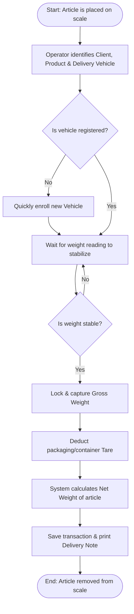

# 🖥️ OmniWeigh

**OmniWeigh** is a modern, high-performance industrial desktop application designed to automate, streamline, and secure metrological weighing operations. It interfaces directly with hardware weighing terminals via serial communication to capture weight data in real-time, eliminating manual data entry errors, omissions, and operational fraud.

The software is engineered with a strict modular monolithic architecture (**Modulith**), ensuring clear domain boundaries, local reliability, and a seamless path toward future cloud-synchronized deployments.

---

## 📖 Documentations

**OmniWeigh** is thoroughly documented to serve both business and technical audiences. All official documentation is stored in the `documentations/` folder.

### Documentation Fonctionnelle & Métier (Stakeholders & Users)
* [Documentation Prise de Poids](documentations/PriseDePoids_Documentation.md) : Guide détaillant le workflow "Série de Pesée sans pause" (No-Pause Weighing Session), la traçabilité des identifiants (BL, PP), et les spécifications d'impression (A4 vs Thermique 80x80).

### Documentation Technique & Architecture (Engineering)
* [Documentation Technique Globale](documentations/TECHNICAL_DOCUMENTATION.md) : Architectural overview, component diagrams, database schemas, and technical implementation details.
* [Spécifications Techniques Prise de Poids](documentations/PriseDePoids_Documentation.md#2-documentation-technique--architecture-ingénierie) : Flowcharts Mermaid.js d'initialisation et d'enregistrement, dictionnaire de données et modèles SIMEX-ci (`history` table).
* [Architecture & Paramètres Systèmes](documentations/Parametres_Documentation.md) : Dictionnaire de données (Company, HardwareProfile) et cartographie Mermaid.js du `ConfigurationRegistry` (Single Source of Truth).
* [Synchronisation Dynamique des Données](documentations/DataSynchronization_Documentation.md) : Diagramme de séquence Mermaid.js détaillant le cycle de vie d'une sauvegarde via l'Event Broker (`WeakReferenceMessenger`) et le rafraîchissement automatique de l'interface WPF.
* [Rapports & Business Intelligence (BI)](documentations/Rapports_BI_Documentation.md) : Diagramme de flux d'agrégation SQL (Entity Framework), dictionnaire des KPIs de performance, et pipeline d'exportation PDF/Excel.

---

## 🌟 Key Business Features (For Operators & Managers)

OmniWeigh is designed to deliver high reliability, speed, and security on the factory floor, grain silos, or quarry weighing stations:

* **🚫 Zero Manual Entry Errors:** By reading weight values automatically and directly from the weighing scale terminal (via RS-232 or USB), OmniWeigh eliminates costly human typos, omissions, and manual ticket alteration.
* **🔒 Tamper & Fraud Prevention:** The software implements auto-stability detection (verifying when the weight of the goods on the scale has fully stabilized) and ties application licensing to the workstation's unique hardware fingerprint (HWID), preventing unauthorized tampering and data manipulation.
* **🚛 Fast Vehicle & Cargo Management:** Quickly create and reference profiles for regular delivery vehicles, clients, and cargo products. Supports storing vehicle registrations and max load profiles to track which vehicle delivered the goods.
* **📄 Instant Delivery Notes (Bons de Livraison):** Seamlessly generate and print standard Delivery Notes, weight tickets, and receipt logs immediately after a stable weight is acquired.
* **💾 Internet-Independent Reliability:** Designed with an offline-first architecture using a secure, local database. Your weighing stations will continue to run at 100% capacity even during complete internet or network outages.
* **🛠️ Lifetime Maintenance & SAV:** Includes dedicated customer support and priority troubleshooting to ensure maximum uptime, compliance with metrology guidelines, and future OS upgrades.

---

## 🔄 Key Business Workflows (Standard Operating Procedures)

To keep industrial throughput fast and compliant, OmniWeigh supports three main day-to-day workflows:

### 1. Article Weighing & Registration Flow
*This is the main operational flow when goods/articles are weighed, recording which vehicle delivered them:*

1. **Positioning:** The article (e.g., soap raw material, oil drums, or pallets of goods) is placed on the scale.
2. **Identification:** The operator selects the **Client** (owner of the goods), the **Product** (article type), and the **Vehicle** (the delivery vehicle that transported the goods) from the lists.
3. **Real-time Stable Capture:** The system streams the weight from the scale terminal. To prevent errors and ensure metrological integrity, the operator captures the weight once it stabilizes (indicated by the **Stable** badge).
4. **Tare Deduction:** The operator enters or selects the tare weight of the packaging (e.g., the pallet or barrel tare). The system automatically subtracts the tare from the gross weight to calculate the true **Net Weight** of the article.
5. **Validation & Ticket Printing:** The operator clicks *Enregistrer* to save the weighing transaction and prints the official ticket or **Delivery Note (Bon de Livraison)**.

### 2. Quick Entity Enrollment Workflow
*Used when a new customer, product type, or vehicle needs to be added to the registry on-the-fly:*
1. **Direct Access:** The operator clicks the shortcut buttons (`👥 Clients`, `📦 Produits`, or `🚛 Véhicules`) directly from the main interface.
2. **Form Input & Image Attachment:** The operator inputs contact details or dimensions. They can attach an image (e.g., product photo, vehicle registration profile picture) for visual auditing.
3. **Automatic Code Generation:** The database automatically generates a unique identifier (such as `C-00003` for clients, `P-00004` for products) to maintain neat indexing.

### 3. Log Auditing & Re-printing Workflow
*Used by managers to investigate past weights and resolve disputes:*
1. **Search & Filter:** The supervisor navigates to the **Historique** screen and searches by date range, vehicle registration plate, or client reference.
2. **Verify Weighing Metrics:** Displays all metrics (Gross, Tare, Net) along with the operator's name and precise timestamp.
3. **Ticket Duplication:** The manager can select any historical entry and reprint the official ticket on demand.

---

## 🚀 Functional Architecture & Technical Modules

For a deeper dive into code implementation, refer to the [Technical Documentation](documentations/TECHNICAL_DOCUMENTATION.md).

* **Weighing Domain:** Real-time metrological acquisition from hardware scale indicators (RS232/USB) and automated stable state monitoring.
* **Document & Logging Domain:** Local SQLite data persistence, historical logging, and standardized ticket generation.
* **Identity & Security Domain:** Hardware-bound licensing verification (HWID fingerprinting) to prevent unauthorized distribution and execution.

---

## 🛠️ Global Tech Stack

* **Platform:** .NET 10
* **Presentation Layer:** Windows Presentation Foundation (WPF) / MVVM Pattern
* **Architecture Style:** Modulith (Modular Monolith)
* **Hardware Interface:** Serial Port Protocols (RS232 / USB)
* **Local Database:** EF Core with SQLite

---

## 🛠️ Support & Maintenance (SAV)

We believe in maximum operational reliability for industrial environments. OmniWeigh comes with a **lifetime paid technical support and maintenance service (SAV)**. This ensures your weighing stations receive priority troubleshooting, remote assistance, and total compliance with future OS upgrades. Contact the author or authorized commercial partners to establish a formal Service Level Agreement (SLA).

---

## 🛡️ License & Commercial Inquiries

OmniWeigh is **Proprietary Software**. All rights reserved by the author **Granix**. 

The hosting of this source code on a public GitHub repository does not grant any right to copy, modify, distribute, sublicense, or use the application for commercial, industrial, or personal deployment without an official paid license. 

* For purchasing official per-scale licenses, requesting custom industrial modules, or scheduling deployments, please submit an inquiry through official distribution channels or contact the repository owner.
* Review the full terms in the accompanying `LICENSE` file.
