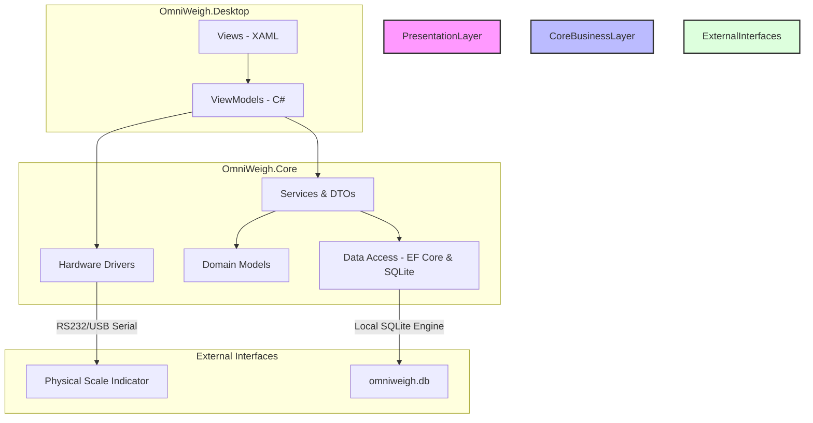
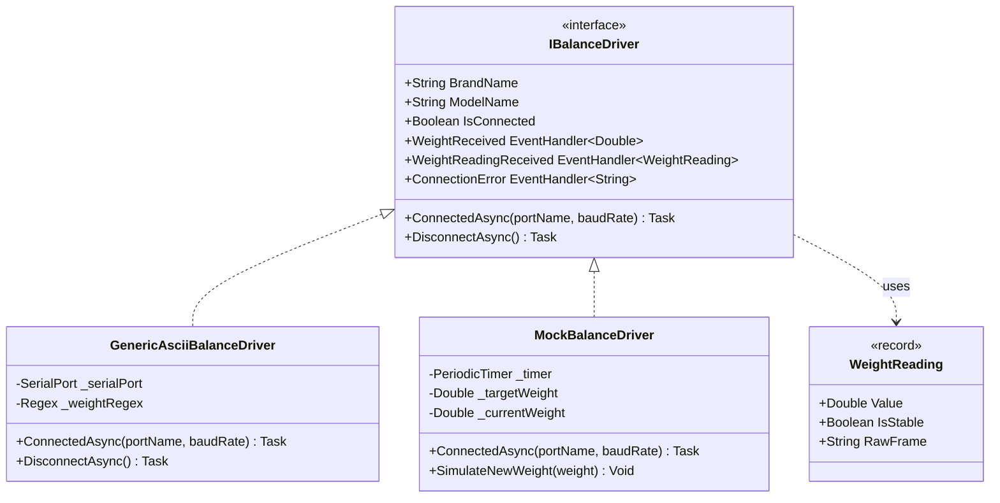
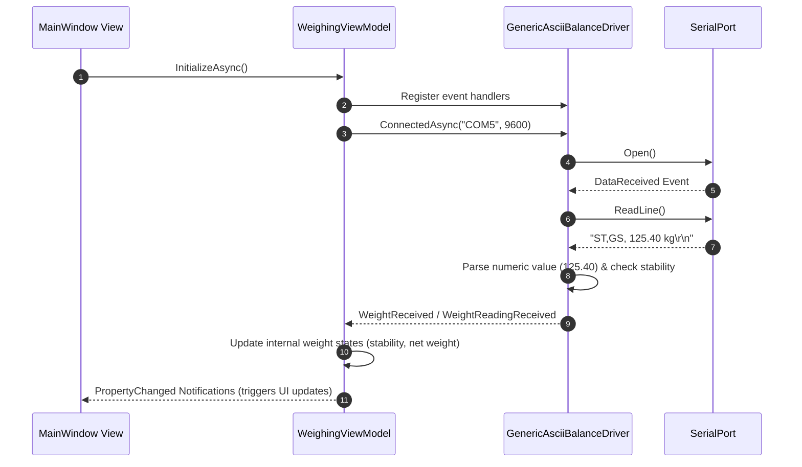
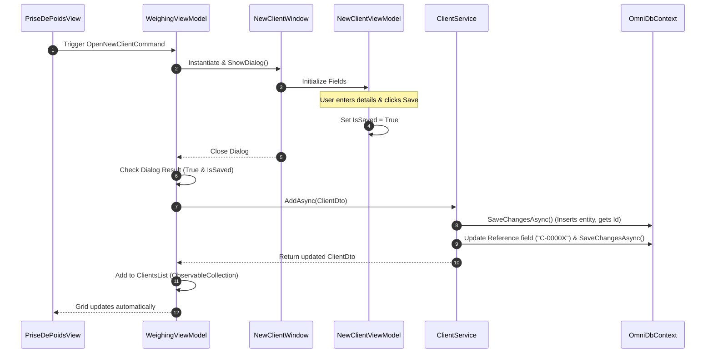
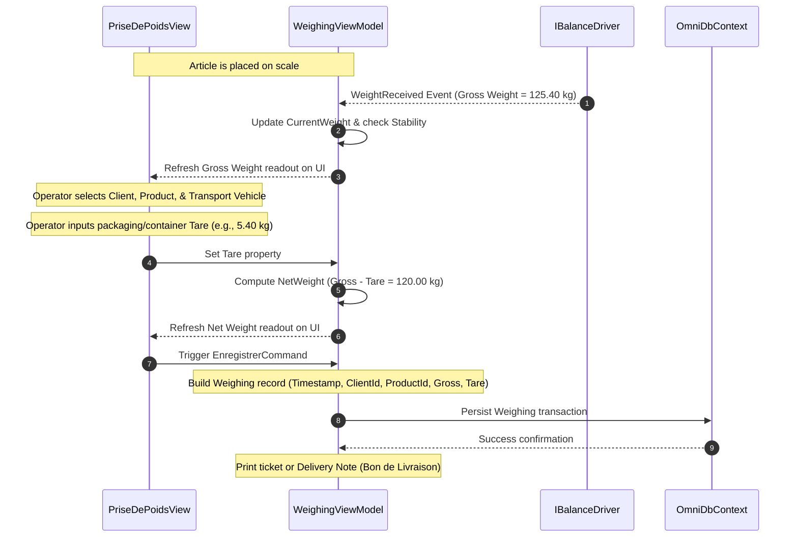
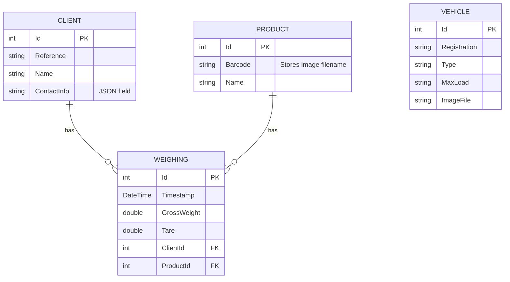
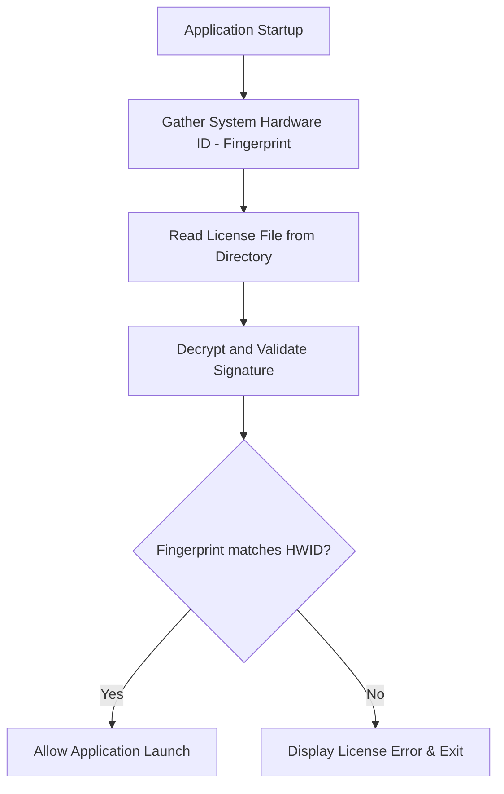

# 🛠️ OmniWeigh Technical Documentation

Welcome to the technical documentation for **OmniWeigh**. This document describes the architecture, component structure, data models, hardware communication protocols, and sequence flows of the application.

---

## 🏗️ Architecture Overview

OmniWeigh is designed as a **Modular Monolith (Modulith)**, separating concerns into distinct logical domains while deploying as a single desktop application. This design provides high reliability in industrial environments, ensuring local autonomy while keeping the codebase maintainable and prepared for potential cloud synchronization.

### 1. Presentation Layer (`OmniWeigh.Desktop`)
Developed using **Windows Presentation Foundation (WPF)** on **.NET 10**, applying the **MVVM (Model-View-ViewModel)** design pattern.
* **Views:** Define the UI layouts and elements in XAML, utilizing centralized styles (`Themes/`) and value converters (`Converters/`).
* **ViewModels:** Manage screen states, input validation, and user commands (e.g. `RelayCommand`), communicating directly with core services via Dependency Injection.

### 2. Core Business Layer (`OmniWeigh.Core`)
Encapsulates business operations, data persistence, and hardware device drivers.
* **Drivers:** Handle serial communication (RS-232 / USB) with weighing terminals.
* **Services:** Manage CRUD operations, business rules, and mapping of entities to Data Transfer Objects (DTOs).
* **Models:** Define core domain entities (e.g., Client, Product, Vehicle, Weighing).
* **Data Access:** Orchestrated by EF Core, persisting data into a local SQLite database file located in the user's `LocalApplicationData` directory.

---

## 🔌 Hardware Interface & Drivers

Industrial scales broadcast weight measurements as character streams via serial connections. The driver subsystem provides real-time metrological data acquisition.

* **[IBalanceDriver](OmniWeigh.Core/Drivers/IBalanceDriver.cs):** The interface defining capabilities, event triggers, and connection states. Supports both legacy simple double event (`WeightReceived`) and metadata-rich record stream (`WeightReadingReceived`).
* **[GenericAsciiBalanceDriver](OmniWeigh.Core/Drivers/GenericAsciiBalanceDriver.cs):** Connects to physical terminals using `System.IO.Ports.SerialPort`. It parses incoming ASCII weight streams using Regular Expressions (`[-+]?[0-9]*\.?[0-9]+`) and raises events on new readings.
* **[MockBalanceDriver](OmniWeigh.Core/Drivers/MockBalanceDriver.cs):** A simulated driver used for development, testing, and demonstration. It uses a `PeriodicTimer` to emulate physical damping and weight transitions.

---

## 📈 Key Sequence Flows

### 1. Scale Initialization & Real-Time Weight Capture
When the application starts, it registers handlers to the balance driver, opens the serial connection, and streams weight updates asynchronously.

### 2. Registering a New Client / Product / Vehicle
Entities are registered locally through dedicated dialogs, validated, saved in SQLite, and dynamically updated in the UI tables.

### 3. Article Weighing & Registration Sequence
Below is the sequence diagram illustrating how the system handles the weighing of an article, tare deduction, net calculation, and logging.

---

## 💾 Data Model & Storage

The database layer is managed by Entity Framework Core targeting a local **SQLite** database (`omniweigh.db`). The database is isolated within the user's `LocalAppData` directory (e.g. `C:\Users\<Name>\AppData\Local\OmniWeigh\omniweigh.db`).

### Schema Diagram

* **Dynamic Columns and Migrations:** The codebase implements on-the-fly table checks. For example, `EnsureReferenceColumnExistsAsync` in `ClientService.cs` inspects database metadata using SQLite `PRAGMA table_info` and dynamically runs `ALTER TABLE` to inject columns if they are absent on older workstations.

---

## 🔒 Identity & Security (License Verification)

As outlined in the software licensing agreement, OmniWeigh enforces hardware-bound licensing verification.

* **Workstation Fingerprinting:** The system queries motherboard serials, CPU IDs, and MAC addresses to compile a unique **Hardware ID (HWID)**.
* **Signature Cryptography:** Valid licenses are cryptographically signed using public/private key pairs to prevent tampering or key bypass.
* **Integrity Enforcement:** The application terminates execution if any licensing constraints are violated.
