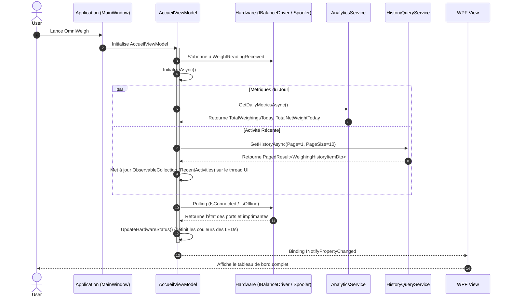

# Module Accueil (Tableau de Bord)

Ce document décrit le module **Accueil**, qui sert de centre de commandement (Tableau de Bord) dès l'ouverture de l'application OmniWeigh. Il offre aux opérateurs un retour visuel instantané sur l'état du matériel, un résumé de l'activité du jour, et un accès rapide aux fonctions essentielles.

---

## 1. Documentation Fonctionnelle (Guide Utilisateur)

L'écran d'accueil est organisé en trois zones principales conçues pour minimiser le temps cognitif de l'opérateur.

### 1.1. Lancement Rapide (Quick Launch)
* **Nouvelle Session :** Un grand bouton central permet de démarrer immédiatement une session de pesée.
* **Raccourci Clavier (F2) :** L'opérateur peut presser la touche `F2` à tout moment depuis l'accueil pour déclencher la commande `NewWeighingSessionCommand` sans utiliser la souris, accélérant ainsi les opérations en milieu industriel.

### 1.2. Monitoring du Matériel (Hardware Diagnostic)
* **État de la Balance :** Un indicateur LED (Vert/Rouge) vérifie si le port série de l'indicateur de poids est ouvert et communique (`Connectée` / `Déconnectée`).
* **Lecture du Poids en Direct (Live Weight) :** Un affichage digital (style LCD) montre le poids actuel lu sur le pont-bascule en temps réel (ex: `12,500 kg`), sans avoir besoin d'ouvrir une session.
* **État de l'Imprimante :** Un indicateur vérifie le gestionnaire d'impression Windows (Spooler) pour confirmer que l'imprimante par défaut est `Prête` ou `Hors Ligne` (par exemple, en cas de manque de papier).

### 1.3. Métriques du Jour (Daily Metrics)
* **Pesées du Jour :** Affiche le nombre total de rotations/camions passés depuis minuit.
* **Tonnage du Jour :** Affiche le poids net total cumulé traité aujourd'hui.

### 1.4. Flux d'Activité Récente
Un tableau (DataGrid) affiche les 10 dernières pesées effectuées (Heure, Référence, Client, Produit, Poids Net).
L'opérateur dispose de boutons d'action rapide sur chaque ligne pour **Réimprimer** (🖨️) le ticket ou **Voir les détails** (ℹ️).

---

## 2. Architecture Technique

Le chargement de l'accueil est optimisé pour être non-bloquant. L'initialisation du ViewModel lance des requêtes asynchrones vers le service d'analyse (`IAnalyticsService`) et le registre de l'historique (`IWeighingHistoryQueryService`), tout en s'abonnant aux événements matériels du `IBalanceDriver`.

### 2.1. Pipeline de Démarrage (Diagramme de Séquence)

### 2.2. Schémas de Données

#### Payload : Activité Récente (`WeighingHistoryItemDto`)
Ce DTO est renvoyé par la base de données et projeté sur le DataGrid d'activité récente.

| Propriété | Type | Description |
| :--- | :--- | :--- |
| `HistoryId` / `SessionId` | `int` / `Guid` | Clés primaires et étrangères de l'enregistrement. |
| `Timestamp` | `DateTime` | L'heure de la capture du poids. |
| `WeighingReference` | `string` | La référence unique de la pesée (ex: `PP-000125`). |
| `DocumentNumber` / `Type` | `string` | Le numéro et type du document rattaché (ex: `BL-0042`). |
| `ClientName` | `string` | Le nom du client. |
| `ProductName` | `string` | Le nom de la marchandise ou du produit. |
| `GrossWeight`, `Tare` | `double` | Le poids brut lu et la tare appliquée. |
| `NetWeight` | `double` | Le poids final calculé. |
| `Unit` | `UnitType` (Enum) | L'unité (généralement `KG`). |

#### Diagnostic Matériel : Statuts Internes du ViewModel
Propriétés exposées par `AccueilViewModel` pour contrôler dynamiquement les indicateurs (LEDs) de la vue.

| Propriété | Rôle et Valeurs possibles |
| :--- | :--- |
| `ScaleStatus` | Texte descriptif : `"Connectée"` ou `"Déconnectée"`. |
| `ScaleStatusColor` | Code Hex UI : `#2ECC71` (Vert) ou `#E74C3C` (Rouge). |
| `PrinterStatus` | Texte : `"Prête (Nom_Imprimante)"`, `"Hors Ligne"`, ou `"Aucune impr."`. |
| `PrinterStatusColor` | Code Hex UI : `#3498DB` (Bleu/Prêt), `#F1C40F` (Jaune/Offline), `#E74C3C` (Rouge/Erreur). |
| `LiveWeight` | Chaîne formatée représentant l'événement reçu via `IBalanceDriver.WeightReadingReceived`. |
