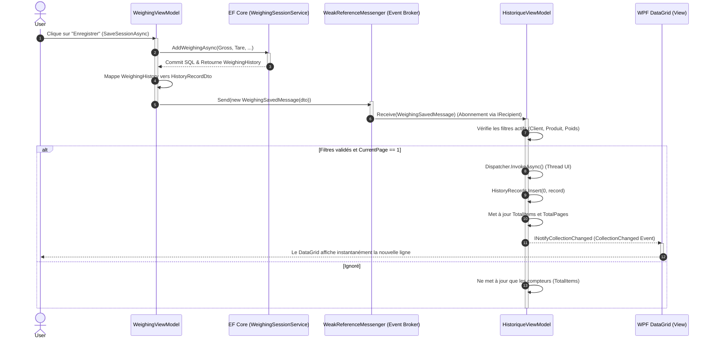

# Synchronisation Dynamique des Données (Event Broker)

Ce document décrit le correctif d'architecture (fix) mis en place pour garantir la synchronisation en temps réel entre le processus de **Prise de Poids** (Weighing Workflow) et le système d'**Historique** (History System). 

Avant ce correctif, l'utilisateur devait rafraîchir manuellement le tableau d'historique pour voir les nouvelles pesées. Désormais, l'application utilise un patron de conception basé sur un bus de messages (Event Broker) via `WeakReferenceMessenger` du `CommunityToolkit.Mvvm`, assurant une réactivité immédiate sans couplage fort entre les composants de l'interface utilisateur.

---

## 1. Architecture de Synchronisation d'État

Le cycle de vie complet d'une opération de sauvegarde ("Enregistrer") traverse les couches de l'application selon la séquence stricte détaillée ci-dessous. L'utilisation du `Dispatcher` garantit que l'interface utilisateur est mise à jour de manière asynchrone sur le thread principal (UI Thread).

### Diagramme de Séquence (Lifecycle)

---

## 2. Détails d'implémentation

### 2.1. Diffusion du Message (Broadcast)
Lorsqu'une transaction de pesée est complétée avec succès en base de données, le `WeighingViewModel` agit en tant que producteur (Publisher). Il instancie un message typé `WeighingSavedMessage` contenant le DTO (`HistoryRecordDto`) du nouvel enregistrement et l'envoie via le canal global `WeakReferenceMessenger.Default.Send()`. Cette méthode "Fire-and-forget" permet au processus de prise de poids de ne pas se soucier de qui consomme la donnée.

### 2.2. Interception par Abonnement (Subscription)
Le `HistoriqueViewModel` agit en tant que consommateur (Subscriber). 
1. **Enregistrement :** Dans son constructeur, il s'inscrit au bus via `WeakReferenceMessenger.Default.Register(this)`.
2. **Réception :** Il implémente l'interface `IRecipient<WeighingSavedMessage>`, l'obligeant à fournir la méthode `Receive(WeighingSavedMessage message)`.

### 2.3. Mutation de l'ObservableCollection
Afin d'éviter des plantages liés aux accès concurrents inter-threads ("Invalid cross-thread access"), le `HistoriqueViewModel` enveloppe la mutation de sa liste dans `System.Windows.Application.Current.Dispatcher.InvokeAsync()`.

* Si la page actuellement consultée est la page 1 (`CurrentPage == 1`), le nouvel enregistrement est **inséré au sommet de la liste** (`Insert(0, record)`). 
* Si le nombre d'éléments dépasse la taille de page maximale (`_pageSize`), le dernier élément est retiré de la collection pour maintenir une pagination cohérente.
* WPF écoute l'interface `INotifyCollectionChanged` de l'`ObservableCollection` et rafraîchit le `DataGrid` sans rechargement complet depuis la base de données.
