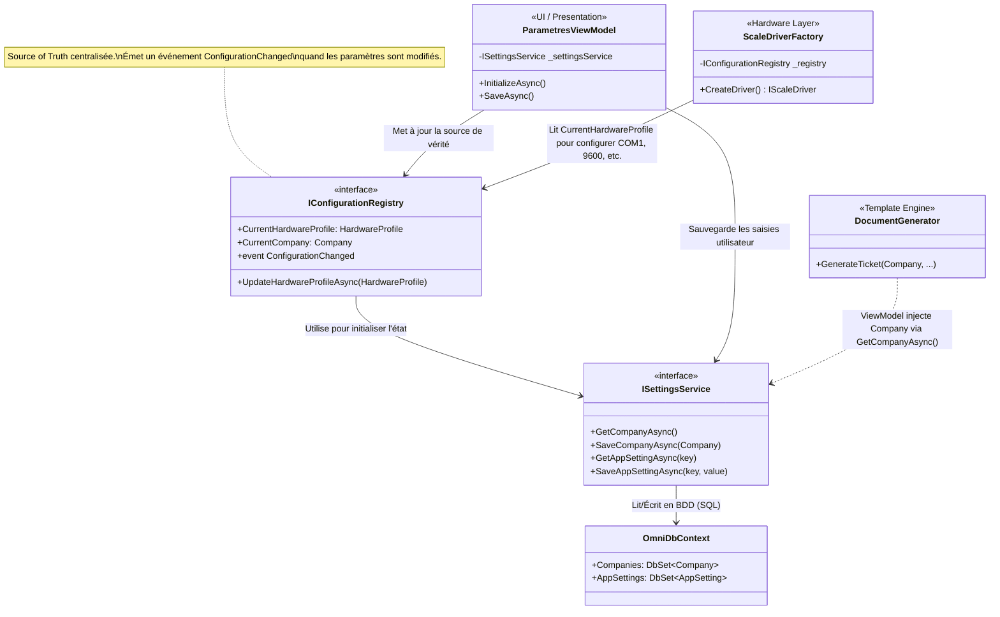

# Module de Paramétrage (Configuration & Hardware)

Ce document décrit la structure, le schéma de données et l'architecture logicielle du module de **Paramètres** dans OmniWeigh. Ce module centralise les informations de l'entreprise (profil client) ainsi que la configuration matérielle des ports série (COM) pour la communication avec les indicateurs de pesée.

---

## 1. Dictionnaire de Données de Configuration

La configuration du système est divisée en deux catégories principales : le profil de l'entreprise et les paramètres matériels (Hardware). Ces données sont stockées via Entity Framework Core dans les tables `Companies` et `AppSettings`.

### 1.1. Schéma de l'Entreprise (`Company`)
Ce schéma contient les informations légales et visuelles de l'entreprise qui exploite le pont-bascule.

| Propriété C# | Type | Description | Intégration Documentaire (SIMEX-ci, BL) |
| :--- | :--- | :--- | :--- |
| `Id` | `int` | Clé primaire (Singleton, généralement `Id = 1`) | Non affiché |
| `Name` | `string` | Raison sociale de l'entreprise | **En-tête principal** des documents PDF et impressions WPF (remplace "SIMEX-ci"). |
| `Slogan` | `string` | Slogan ou sous-titre de l'entreprise | Sous-titre dans l'en-tête du document (ex: "Pesage • Métrologie"). |
| `Address1` | `string` | Première ligne d'adresse | Ligne d'adresse 1 de l'en-tête. |
| `Address2` | `string` | Seconde ligne d'adresse (complément) | Ligne d'adresse 2 de l'en-tête. |
| `Phone` | `string` | Numéro de téléphone de contact | Affiché avec le préfixe "Tél :" dans l'en-tête. |
| `Email` | `string` | Adresse électronique de contact | Affiché avec le préfixe "Email :" dans l'en-tête. |
| `LogoPath` | `string` | Chemin absolu vers l'image du logo | Injecté en tant qu'image dans l'**En-tête (Coin supérieur gauche)** du document final. |

### 1.2. Paramètres Matériels (`HardwareProfile` & AppSettings)
Les configurations de communication série sont gérées via la table de type Clé/Valeur `AppSettings` pour permettre une extension facile de la configuration sans modifier le schéma SQL.

| Clé (AppSetting) / Propriété | Type / Valeur par défaut | Description & Usage |
| :--- | :--- | :--- |
| `ScaleDriver` / `DriverType` | `string` ("MockBalanceDriver") | Définit le type d'interface à instancier (`MockBalanceDriver`, `SerialPortDriver`, etc.). Utilisé par le `ScaleDriverFactory`. |
| `ComPort` | `string` ("COM1") | Le port série logique sur lequel l'indicateur est branché. (ex: COM1, COM3, /dev/ttyUSB0). |
| `BaudRate` | `int` (9600) | Vitesse de transmission série (bauds par seconde). |
| `DataBits` | `int` (8) | Nombre de bits de données dans la trame série (généralement 7 ou 8). |
| `Parity` | `string` ("None") | Bit de parité pour la détection d'erreurs ("None", "Odd", "Even", "Mark", "Space"). |
| `StopBits` | `string` ("One") | Bits d'arrêt ("None", "One", "Two", "OnePointFive"). *Stocker en DB mais souvent figé à 1 en UI*. |

---

## 2. Cartographie de l'Architecture (Single Source of Truth)

Dans `OmniWeigh.Core`, la configuration est centralisée autour du **`ConfigurationRegistry`** (qui maintient l'état en mémoire) et du **`SettingsService`** (qui gère la persistance en base de données). Ce pattern garantit qu'il n'y a qu'une seule "Source de Vérité" (Single Source of Truth) pour toute l'application.

### 2.1. Flux d'utilisation des données
1. **Frontend (ViewModels) :** Le `ParametresViewModel` interagit directement avec `ISettingsService` pour charger et sauvegarder les paramètres saisis par l'utilisateur. Lorsqu'une sauvegarde a lieu (ex: changement de port COM), la base de données est mise à jour.
2. **Couche Base de Données (DB Layer) :** `OmniDbContext` stocke la configuration de manière persistante (SQLite/SQL Server).
3. **Moteur de Templates (Génération PDF/WPF) :** Lors de la génération d'un bon de livraison, les ViewModels (comme `WeighingViewModel`) interrogent les paramètres de l'entreprise pour construire dynamiquement l'en-tête du document (Nom, Logo, Adresse) et l'injecter dans `DocumentGenerator` ou `QuestPdfExportService`.
4. **Pilotes Matériels (Scale Drivers) :** Le `ScaleDriverFactory` écoute ou interroge le `ConfigurationRegistry` (qui met en cache le `HardwareProfile`). Lorsqu'une balance physique doit être interrogée, la Factory configure le flux `SerialPort` avec exactement les valeurs `ComPort`, `BaudRate` ou `DataBits` fournies par la Registry. Les modifications dans cette Registry nécessitent souvent un redémarrage de la connexion série.
