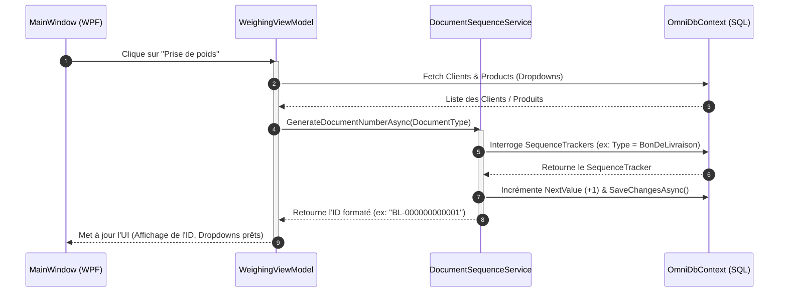
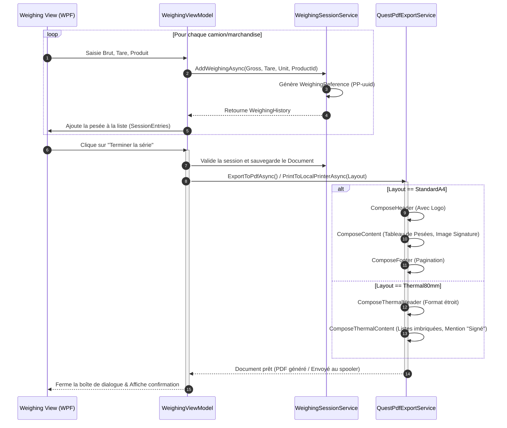

# Documentation du Système de "Prise de Poids" (Weighing Session)

Cette documentation décrit le flux d'exécution, l'architecture des données et les modèles du processus de pesée (Prise de poids) d'OmniWeigh, conçu spécifiquement pour notre intégration au profil **SIMEX-ci**. 

Elle s'adresse aussi bien aux **parties prenantes fonctionnelles** (Directeurs, Utilisateurs, Chefs de projet) qu'aux **ingénieurs logiciels** chargés d'étendre ou de maintenir la plateforme.

---

## 1. Documentation Fonctionnelle (Guide Utilisateur & Client)

### 1.1. Le Workflow "Série de Pesée sans pause" (No-Pause Weighing Session)

Le module de "Prise de Poids" a été conçu pour maximiser la productivité des opérateurs de pont-bascule. Lorsqu'une file de camions ou de marchandises attend d'être pesée, le logiciel permet de regrouper de multiples pesées sous un même document principal (par exemple, un **Bon de Livraison** ou un **Bon de Réception**).

**Comment ça marche ?**
1. **Initialisation :** L'opérateur ouvre une nouvelle session. Le système génère automatiquement un document maître (ex: Bon de Livraison).
2. **Pesées consécutives :** Pour chaque passage sur la bascule, l'opérateur valide la pesée. Une référence unique de pesée est générée instantanément. Le poids brut et la tare sont capturés sans obliger l'utilisateur à naviguer hors de l'écran principal.
3. **Clôture :** Une fois la série terminée, l'opérateur clique sur "Terminer la série". Le logiciel regroupe alors l'historique complet de la session et génère le document final.

### 1.2. Comprendre la Génération Automatique des Identifiants

Afin de garantir la traçabilité complète des marchandises, le système utilise deux niveaux d'identifiants :

* **Le Numéro de Document (ex: `BL-000000000125`)** :
  * **Rôle :** Représente la transaction globale (la facture, le bon de livraison).
  * **Format :** Un préfixe dynamique (`BL` pour Bon de Livraison, `BS` pour Bon de Sortie, `FA` pour Facture) suivi de 12 chiffres incrémentés automatiquement. 
  * **Garantie :** Aucun trou de numérotation n'est permis, même en cas d'utilisation simultanée sur plusieurs postes.

* **La Référence de Pesée (ex: `PP-a1b2c3d4...`)** :
  * **Rôle :** Représente un mouvement de poids individuel sur la bascule dans le cadre du document maître.
  * **Format :** Le préfixe `PP-` (Prise de Poids) suivi d'un identifiant unique (UUID).

### 1.3. Impression : Différences entre le Format A4 et le Format Thermique (80x80)

Une fois la série de pesée terminée, l'application OmniWeigh génère des rapports d'impression. Pour s'adapter au terrain, deux formats sont supportés :

| Élément Inclus | Format A4 (Standard Bureau) | Format Thermique 80x80 (Compact) |
| :--- | :--- | :--- |
| **En-tête** | Type (ex: BON DE LIVRAISON), Réf. du document, Date et Heure, Emplacement réservé pour le Logo Entreprise (ex: SIMEX-ci). | Type centré, Réf. du document, Date et Heure, Ligne de séparation. |
| **Informations Globales** | Informations complètes du Client, Nom du Chauffeur. | Nom du Chauffeur, Nom du Client. |
| **Détails des Pesées** | **Tableau complet structuré** avec des colonnes : Réf. Pesée, Brut, Tare, Net, Unité. | **Affichage linéaire** : Réf de la pesée en gras, suivie des valeurs Brut, Tare et Net empilées. |
| **Pied de page & Signature** | Pagination ("Page X sur Y"), **Image de la signature** numérisée de l'opérateur ou du chauffeur. | Pas de pagination. Mention texte **"Signé"** si une signature est enregistrée. |

---

## 2. Documentation Technique & Architecture (Ingénierie)

### 2.1. Intégration Base de Données (La table `WeighingHistory`)

Les enregistrements de pesée sont persistés via Entity Framework Core dans la table SQL `WeighingHistory`. 
Cette table est liée par clé étrangère à la table `WeighingSession` (relation 1-N) et à la table `Product` (relation N-1). 

**Points techniques clés :**
* Le **Poids Net (`NetWeight`)** n'est pas stocké physiquement en base. C'est une propriété calculée à la volée (`GrossWeight - Tare`) au niveau du modèle C# pour éviter les désynchronisations de données.
* La génération de la séquence `BL-xxxx` est gérée par le service `DocumentSequenceService` qui interroge et incrémente la table `SequenceTracker` (suivi des compteurs par `EntityType`).

### 2.2. Diagrammes de Flux de Séquence (Mermaid.js)

#### Flow 1 : Initialisation de Session & Génération d'ID
Ce flux illustre comment l'interface utilisateur WPF initialise la prise de poids.

#### Flow 2 : Enregistrement des Pesées & Impression (A4 / Thermique)
Ce flux détaille la boucle d'enregistrement sans pause et le rendu final.

### 2.3. Dictionnaire de Données (Modèles SIMEX-ci)

L'implémentation repose sur le mappage des entités vers le profil client SIMEX-ci. Voici les spécifications des API et des modèles.

#### Modèle `Document` (En-tête et Métadonnées)
Ce modèle agrège les métadonnées de la transaction pour SIMEX-ci.

| Champ | Type (C#) | Description métier | Exemple / Valeur par défaut |
| :--- | :--- | :--- | :--- |
| `DocumentNumber` | `string` | ID auto-incrémenté global | `BL-000000000001` |
| `Type` | `DocumentType` | Enum définissant la nature de l'opération | `BonDeLivraison`, `Facture` |
| `CreatedAt` | `DateTime` | Horodatage de création | `2026-07-16 14:30:00` |
| `DriverName` | `string` | Nom du chauffeur intercepté | "Jean Dupont" |
| `Client` | `Client` | Objet contenant les infos du client | SIMEX-CI, MADAGASCAR, LOGISTIQUE S.A. |
| `SignatureBase64` | `string` | Chaîne encodée de la signature numérisée | `data:image/png;base64,...` |

#### Modèle `WeighingHistory` (Historique des Pesées - Table `history`)
Ce modèle trace individuellement le contenu du pont-bascule.

| Champ | Type (C#) | Description métier | Remarques |
| :--- | :--- | :--- | :--- |
| `Id` | `int` | Clé primaire SQL | PK, Identity |
| `SessionId` | `Guid` | Clé étrangère vers la session parente | FK -> `WeighingSession` |
| `WeighingReference` | `string` | Référence métier unique de la pesée | Format : `PP-` + UUID |
| `ProductId` | `int` | Produit lié (Désignation) | FK -> `Product` |
| `GrossWeight` | `double` | Poids brut enregistré | Capture depuis l'indicateur |
| `Tare` | `double` | Tare du camion/contenant | Saisie manuelle ou en mémoire |
| `NetWeight` | `double` | Poids net de la marchandise | Calculé : `GrossWeight - Tare` |
| `Quantity` | `double` | Quantité physique | Lié au champ `Unit` |
| `Unit` | `UnitType` | Unité de mesure (Enum) | `PCS` (Pièces), `KG` |
| `Observation` | `string?` | Bloc de commentaires ou remarques | Nullable |

#### Modèle `Product` (Catalogue Produits)
| Champ | Type (C#) | Description métier | Remarques |
| :--- | :--- | :--- | :--- |
| `Name` | `string` | Désignation du produit | - |
| `Barcode` | `string` | Code-barres ou référence image (Desktop) | Utilisé dans l'UI Desktop |
| `UnitPrice` | `decimal` | Prix unitaire (Obligatoire) | Défaut: `0m` |
| `Currency` | `string` | Devise utilisée | Défaut: `"MGA"` (Ariary) |
