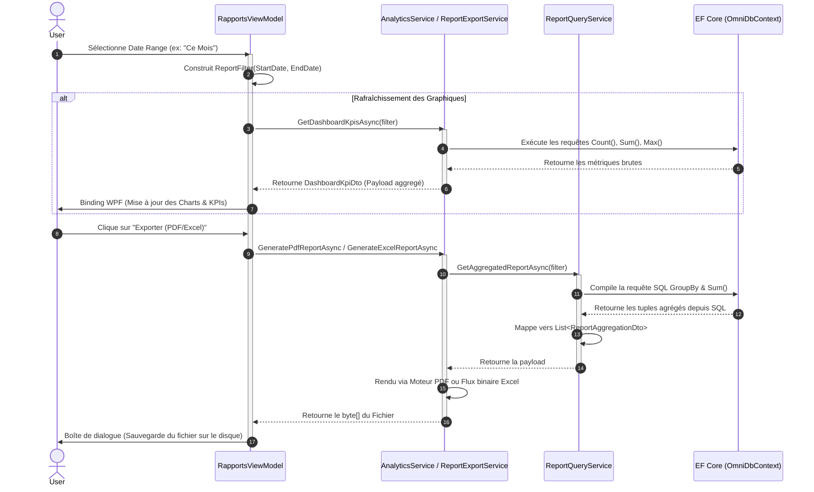

# Module Business Intelligence (BI) & Rapports

Ce document détaille l'architecture et les fonctionnalités du module de **Business Intelligence (Rapports)**. Il explique comment les données brutes de pesée sont transformées en indicateurs clés de performance (KPI) stratégiques pour les gestionnaires de site, ainsi que les mécanismes de synchronisation et d'exportation.

---

## 1. Documentation Fonctionnelle (Guide BI)

Le tableau de bord décisionnel offre aux managers une vision claire des opérations sur le pont-bascule.

### 1.1. Les Indicateurs Clés de Performance (KPIs)
* **Volume Total Transporté (TotalVolume) :** La somme de tous les poids nets traités sur la période sélectionnée. Cet indicateur est vital pour suivre le tonnage journalier ou mensuel.
* **Nombre de Rotations (TotalSessions) :** Le nombre total de passages sur le pont-bascule. Cela reflète le trafic et l'occupation du site.
* **Top Produit (TopProduct) :** Le produit ou la matière première ayant généré le plus grand volume (en poids net).
* **Top Client (TopClient) :** Le client ou partenaire logistique ayant généré le plus d'activité.
* **Poids Moyen par Session (AverageWeightPerSession) :** Poids net moyen d'un camion ou d'un pesage. Utile pour détecter les surcharges ou les chargements sous-optimisés.

### 1.2. Exportations Exécutives (PDF & Excel)
Le module permet d'extraire la donnée analytique sous deux formats professionnels :
* **Rapport Exécutif PDF :** Un document synthétique, prêt à être imprimé ou envoyé par e-mail, formaté avec le logo de l'entreprise. Il affiche les totaux agrégés (par Produit ou par Client) avec un rendu visuel net.
* **Extraction Excel (.xlsx) :** Permet une analyse plus profonde. Les données sont exportées sous forme de tableau formaté, permettant aux analystes de créer leurs propres tableaux croisés dynamiques (TCD).

---

## 2. Documentation Technique & Architecture

L'architecture du module BI repose sur un pipeline de données asynchrone utilisant Entity Framework Core pour l'agrégation en base de données, évitant de charger des millions de lignes en mémoire.

### 2.1. Pipeline de Traitement BI (Diagramme de Séquence)

### 2.2. Schémas de Données & Paramètres de Requêtes

#### DTO : Filtres de Requête (`ReportFilter`)
Objet utilisé pour filtrer toutes les requêtes du module BI avant l'agrégation SQL (clause `WHERE`).

| Propriété | Type | Description |
| :--- | :--- | :--- |
| `StartDate` | `DateTime?` | Borne inférieure temporelle (début de période). |
| `EndDate` | `DateTime?` | Borne supérieure temporelle (fin de période). |
| `ClientId` | `int?` | Filtre optionnel par identifiant Client. |
| `ProductId` | `int?` | Filtre optionnel par identifiant Produit. |
| `DocumentType` | `string?` | Filtre par nature du mouvement (BL, BS, FA). |
| `GroupBy` | `GroupByMode` | Spécifie l'axe d'agrégation : `ByProduct` (défaut) ou `ByClient`. |

#### DTO : Payload d'Agrégation (`ReportAggregationDto`)
Représente une ligne de résultat consolidée après un `GROUP BY` exécuté côté serveur SQL sur la table `WeighingHistory`.

| Propriété C# | Type SQL Généré | Description métier |
| :--- | :--- | :--- |
| `GroupName` | `NVARCHAR` | Le nom du Produit ou du Client servant d'axe d'analyse. |
| `Unit` | `INT` (Enum) | L'unité de mesure pour regrouper de manière cohérente (ex: KG). |
| `TotalPesees` | `COUNT(*)` | Le nombre total de pesées (rotations) pour ce groupe. |
| `PoidsBrutTotal`| `SUM(GrossWeight)` | La somme consolidée des poids bruts. |
| `TareTotal` | `SUM(Tare)` | La somme consolidée des tares. |
| `PoidsNetTotal` | `SUM(GrossWeight - Tare)` | La somme des poids nets réels (calculée dynamiquement en SQL). |
| `MoyennePoidsNet`| `AVG(GrossWeight - Tare)` | Le poids net moyen par rotation/camion. |
